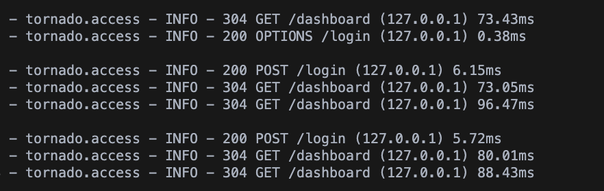
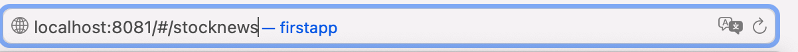

# 测试文档

## 1. 引言

### 1.1 编写目的

本报告为量化交易系统产品的安全测试报告，目的在考察软件安全性、测试结论以及测试建议。

### 1.2 项目背景

此项目为《金融软件工程》课程的大作业,由李锵,张弈垚,龚曹钦炜,李俞成四位学生合作完成。

## 2. 测试概要

### 2.1 测试方法和测试工具

本次安全测试，主要使用了账号安全管理、权限管理、安全日志、访问控制安全、输入安全、缓冲区溢出等安全测试方案。

本次测试针对以上提供的测试方案进行对应测试用例以及测试脚本编写。

### 2.2 账号安全管理

账号的唯一性：系统中账号名称具有唯一性

* 注册用户具有唯一性

* 是否有可能绕过系统的账号唯一性校验

账号不能写死在代码中，须提供可管理机制

### 2.3 权限管理

* 采用基于角色的账号权限管理模型

* 授权和用户角色数据存放在服务器端

### 2.4 安全日志

* 对安全事件以及操作事件记录日志。

* 检查系统是否对以上所以操作记录相应日志记录,包括用户ID、用户IP、时间、事件类型、操作来源(APP、网页等）。

### 2.5 访问控制安全

需要验证用户身份以及权限的页面,复制该页面的url地址,关闭该页面以后,查看是否可以直接进入该复制好的地址。

### 2.6 输入安全

量化交易系统主要对没有被验证的输入进行如下测试:

数据类型(字符串,整形,实数等)允许的字符集,最小和最大的长度,是否允许空输入,参数是否为必须,是否允许重复,数值范围,特定的值(枚举型)特定的模式(正则表达式)等。

### 2.7 缓冲区溢出

没有加密关键数据：

例:view-source http地址可以查看源代码

在页面输入密码,页面显示为加密字符\*\*\*\*，右键鼠标，查看源文件就可以看到刚刚输入的密码。

## 3. 测试结果及缺陷分析

### 3.1测试结果

* 针对账号安全管理：

无法进行重复注册,重复注册将显示注册失败。

* 针对权限管理:

用户信息都存放在数据库当中。

* 针对安全日志:

后端实施输出并记录用户在前端的操作。

* 针对访问控制安全:

之后页面将会跳转到登录界面,显示需要登录才能访问。

* 针对输入安全:

软件对用户输入做了多重判断。

* 针对缓冲区溢出：

  

密码被保护加密。

### 3.2 遗留缺陷列表

暂未实现对单用户在多地登录的检验和判断。

## 4.测试结论

* 本次测试覆盖全面,测试数据基础合理,测试有效。

* 账号安全测试,测试发现已对用户账号密码进行了判断与存储,测试通过。

* 权限测试,已严格对相关角色进行权限控,测试通过。

## 5. 测试建议

在系统研发时便需要逐步对相关字符进行转义,可列成安全文档,定义如何防范各种安全漏洞,以便在开发项目阶段直接杜绝问题。
