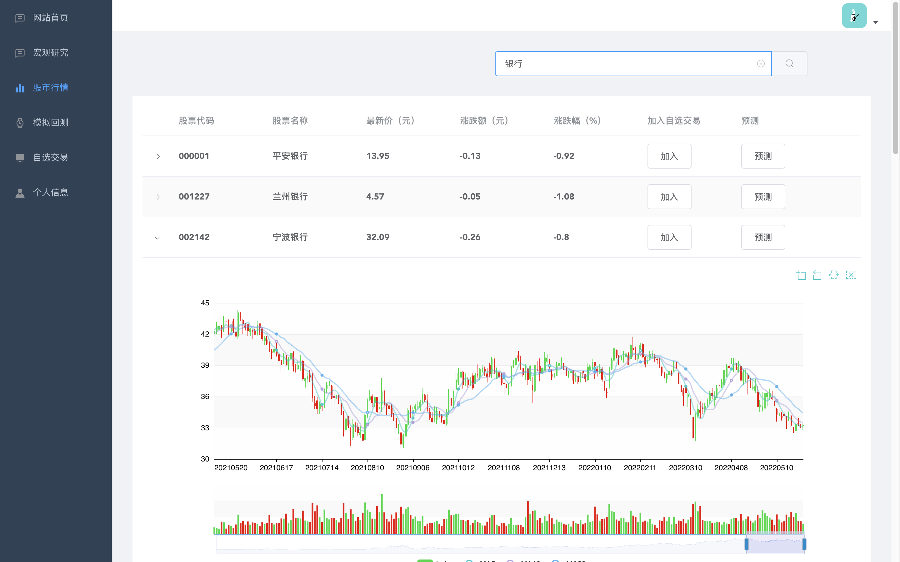
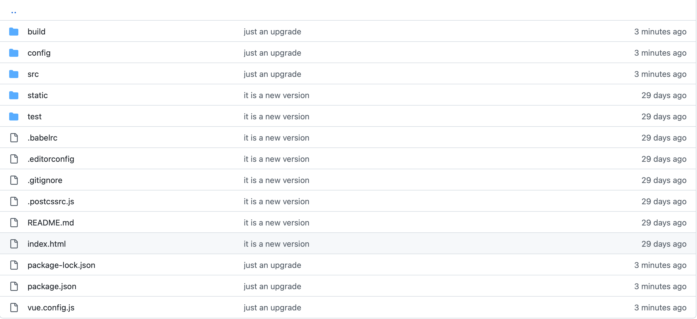
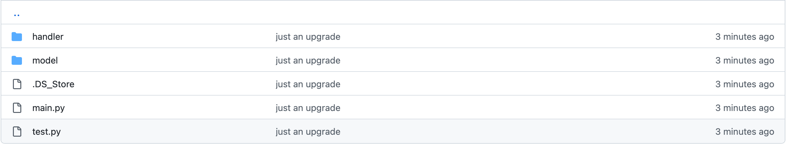
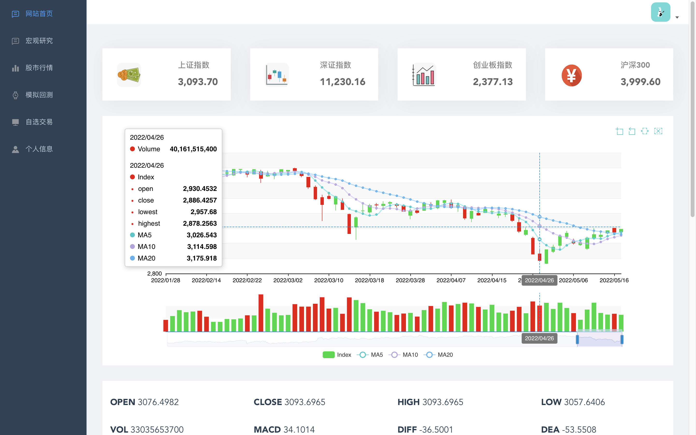
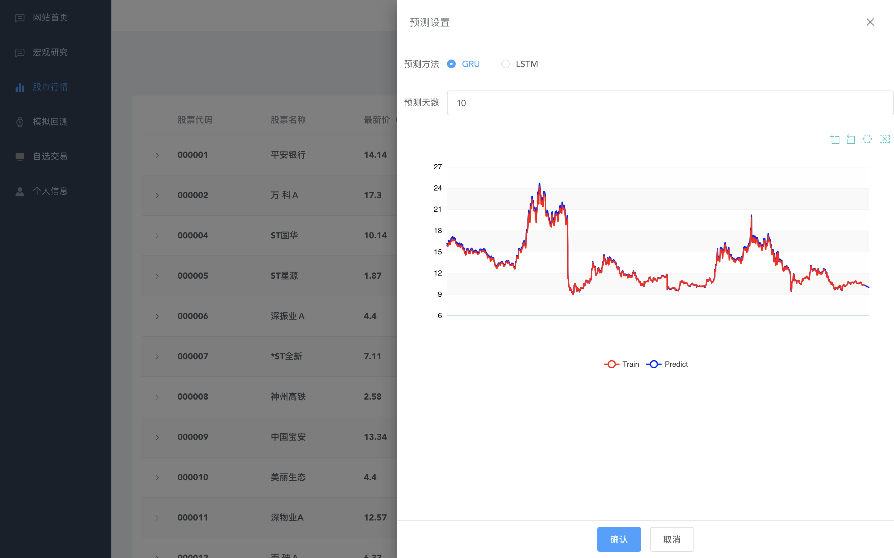
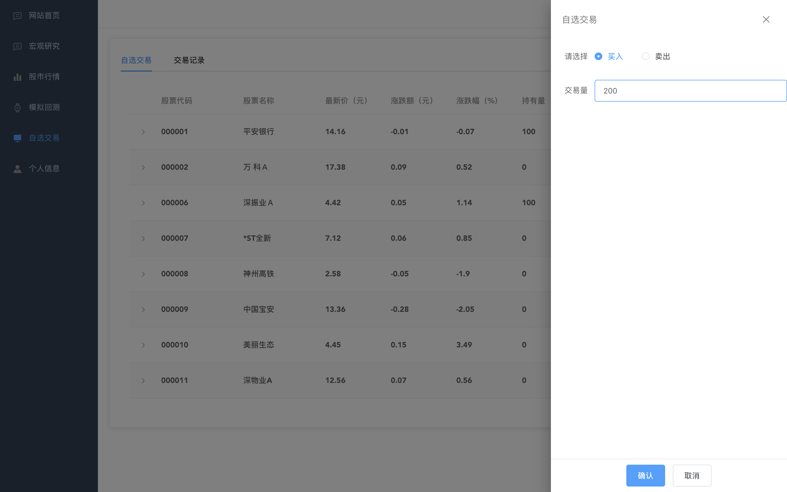
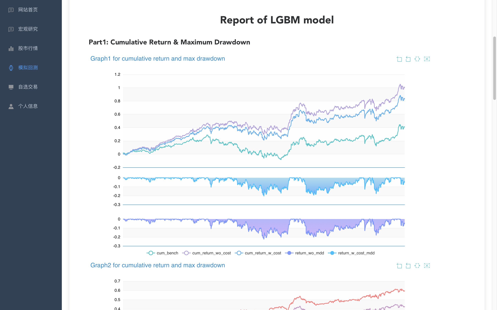

---
author:
- 李锵，张弈垚，龚曹钦炜，李俞成
title: 用户手册
---

# 1. 引言

## 1.1 编写目的

此用户手册读者对象为用户与使用者。

## 1.2 项目背景

此项目为《金融软件工程》课程的大作业，由李锵，张弈垚，龚曹钦炜，李俞成四位学生合作完成。

# 2. 软件概述

## 2.1 目标

此软件开发目标为建立一个功能较为全面的人性化量化交易平台，为用户提供多种功能，多种选择。

## 2.2 功能

* 网站首页: 展示大盘的行情以及相关数据，最新的宏观研究报告。
* 股市行情: 以可视化的方式呈现各支股票的走势，用户可以选择股票加入其自选股票。
* 价格预测: 通过 LSTM，GRU 两种模型对未来单只股票进行未来价格预测。
* 模拟交易: 用户可以自行选择多种策略，多种参数，时间区域，对单只股票进行回测，返回收益率等盈利相关的参数。由于机器学习训练时间较长，目前仅对已经训练好的模型的相关数据结果进行展示。关于所使用的机器学习模型以及更多相关内容参见相关发布文档部分。
* 我的股票: 用户可以选择股票加入其自选股票，方便查看特别关心的股票的走势以及价格波动。同时，用户可以对自己收藏的股票进行实时的交易。
* 交易记录: 方便用户查看历史交易信息。
* 个人信息: 展示以及修改用户名，注册邮箱，密码，个人简介，充值等。

## 2.3 性能

* **数据精确度:** 可精确至小数点后至少两位。

* **时间特性:** 响应时间除预测回测外均在0.1s以内，能够短时间内相应用户的基本操作。预测部分需要进行模型的训练，响应时间在15s左右。回测部分因为深度学习时间较长，目前仅提供已训练样本的展示。

* **灵活性:** 目前软件适配各类操作系统的PC端，灵活性较强。

# 3. 运行环境

## 3.1 硬件

* a. 计算机型号、主存容量；

* b. 外存储器、媒体、记录格式、设备型号及数量；

* c. 输入、输出设备；

* d. 数据传输设备及数据转换设备的型号及数量。

## 3.2 支持软件

* a. Windows7，8，10，MacOS，Linux

* b. Python 3.8

* c. MySQL 8.0.25

# 4. 使用说明

## 4.1 安装和初始化

无需安装，访问网页即可。主页内容无需登录就可以访问，其余功能需要用户进行注册和登录。

## 4.2 输入

下面以用户注册为例，对输入相关内容进行描述。

### 4.2.1 数据背景

数据来源为用户。存储媒体为硬盘。

### 4.2.2 数据格式

* 数据长度从3个字符至8个字符不等。

* 数据为浮点数或整百数或字符串。

* 输入的数据若不合规范会对用户进行提醒，重新输入。

### 4.2.3 输入举例

注册时，用户需输入用户名，密码与邮箱.用户名为字符串格式，从3个字符至8个字符不等.密码也为字符串格式，
从3个字符至8个字符不等。邮箱使用正则表达式判断，需要输入正确的邮箱。若用户注册时输入的数据格式正确，则跳转到登录
页面，显示注册成。若用户输入的格式不正确，则弹出弹窗对用户进行提醒。

如下图所示：

## 4.3 输出

下面以搜索股票行情为例，对输入相关内容进行描述。

### 4.3.1 数据背景

输出数据去向后端，存储媒体为硬盘。

### 4.3.2 数据格式

* 数据长度从1个字符至8个字符不等。

* 数据为浮点数或整百数或字符串。

* 输出的数据直接展示为具体数据，可视化图表，或返回给后端。

### 4.3.3 输出举例

例如当用户在股市行情页面搜索银行时，下方页面将会输出符合搜索要求的股票，并给出最新获取的价格信息和过去一段时间的K线
图，以便于用户查看。

如下图所示：

## 4.4 出错和恢复

* 当用户输入数据不符合规范时，网站将会以弹窗的形式弹出警告弹窗，提示用户重新输入或者取消输入。

* 如果出现在预测和回测时数据量过大所导致等待时间过长的情况，网站将会以弹窗的形式弹出提示弹窗，
  提示用户需要等待时间较长.用户可以选择继续等待或者离开当前页面。

## 4.5 求助查询

网页上提供"帮助"按钮，点击跳转至github发布页面，用户可以查看帮助文档，便于新用户使用。

# 5. 运行说明

## 5.1 运行表

* **网站首页:** 用户可以查看到股市的大盘行情，点击不同参数可以查看不同的走势图。页面下方为最新资讯研报，点击"更多"跳转至宏观研究页面。

* **宏观研究:** 用户可以查看最新的研究报告，点击跳转至具体网页，可以进行下拉。
  
* **股市行情:** 用户可以查看所有股票池当中的股票，点击下拉框可以查看该只股票的走势图。右上方的搜索按钮可以方便用户搜索其心仪股票。点击加入自选可以将股票加入其自选池，点击预测会弹出预测界面。在预测界面可以选择时间与预测方式，点击"确定"会在下面绘制预测图。
  
* **模拟回测:** 用户可以自行选择多种策略， 多种参数，时间区域，设置回测算法，点击确定返回给用户回测结果(以图表呈现)。
  
* **自选交易:** 用户可以点击股票进行买入和卖出，也可以查看其历史交易记录。
  
* **个人信息:** 用户可以展示以及修改个人信息， 更换头像， 充值等。

## 5.2 运行步骤

### 5.2.1 运行控制

运行正常时呈现跳转的页面;若运行出现问题则跳转至404，403等页面。

### 5.2.2 输入/输出文件

* 输入文件为数据库当中储存的表格等。

* 输出文件为MySQL当中的表格。

### 5.2.3 启动或恢复过程

登录网页即启动系统，刷新网页即可恢复。

# 6. 非常规过程

若出现网页响应时间过长或信息为空白等情况，请及时联系QQ:1661943255。

# 7. 操作命令一览表

无特殊的操作命令，点击网页上不同按钮即为不同命令。

# 8. 程序文件（或命令文件）和数据文件一览表

# 9. 用户操作举例

* 如下图，进入首页，用户可以查看大盘信息。

* 如下图，用户可以查看相关的宏观研究并跳转到相应链接。

  

* 如下图，用户可以查看股市行情，并选择将股票加入自选。

  

* 如下图，用户可以选择特定股票，利用GRU或LSTM模型进行预测。

  

* 如下图，用户对自选股票进行买入和卖出。

* 如下图，用户可以修改个人信息，包括用户名，注册邮箱，个人简介，密码以及充值。

* 如下图，用户可以选择相应的机器学习模型，查看已训练完成模型的相关图线。
