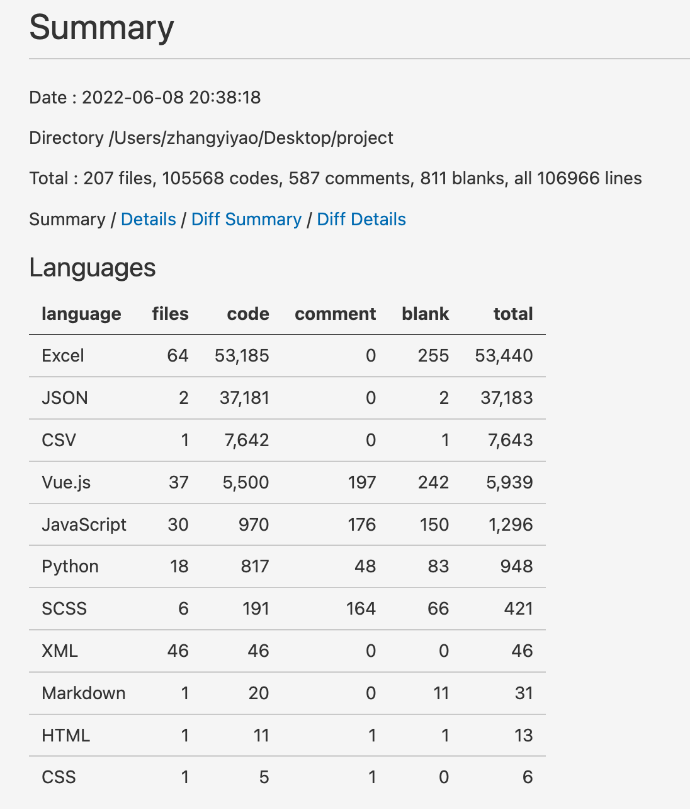
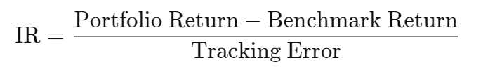

# 发布文档

## 1. 引言

该文档是金融软件工程大作业的发布文档，该大作业由李锵，张弈垚，龚曹钦炜，李俞成四位学生合作完成。

项目的亮点包括以下方面：

* 美观的界面设计
* 用户友好且丰富的功能
* 基于多种机器学习模型的回测展示

## 2. 架构设计

本项目架构设计主要包括三部分：Vue，Python，Mysql。

* Vue制作前端网页界面，通过axios通信方式向后端发送相关请求，获取所需数据。

* Python一方面使用tornado向前端传送数据，另一方面使用pymysql通过sql语句从Mysql数据库中获取数据。另外，Python利用Pytorch，tensorflow等搭建行情预测以及策略回测等机器学习模型，具体模型相关介绍参见本文件第三部分。

* Mysql存储项目所需的各种数据，包括用户的基本信息以及具体股票的历史行情数据。

本项目的架构设计示意图如下。

本项目前端界面设计总体思路如下。

本项目代码量相关信息如下。

## 3. 功能实现

### 3.1 基本功能

* 登录注册：本网站首页无需登录均可访问。其他功能的访问需要进行登录，未注册的用户需要进行注册。注册需要提供新的用户名，密码，注册邮箱；登录需要提供合法的用户名以及密码。网站还支持忘记密码重设密码功能，用户需要输入对应的用户名以及注册邮箱即可设置新的密码。

* 网站首页: 展示大盘的行情以及相关数据，最新的宏观研究报告。
* 股市行情: 以可视化的方式呈现各支股票的走势，用户可以选择股票加入其自选股票。
* 我的股票: 用户可以选择股票加入其自选股票，方便查看特别关心的股票的走势以及价格波动。同时，用户可以对自己收藏的股票进行实时的交易。
* 交易记录: 方便用户查看历史交易信息。
* 个人信息: 展示以及修改用户名，注册邮箱，密码，个人简介，充值等。

### 3.2 扩展功能

#### 3.2.1 预测模型

项目针对行情预测给出了GRU和LSTM两类模型，这两类模型都属于循环神经网络，在之后的回测模型中可以看到更多类型的深度学习模型的应用。

#### 3.2.2 回测模型

##### 策略实现框架示意图

系统设计的初衷之一在于覆盖量化投资的全过程，为用户的AI算法提供高性能的底层基础架构，降低AI算法的使用门槛，便于金融从业者使用。团队网页端的量化交易策略实现由上述各模块构成。每一个部分均为**松散耦合(loose-coupled)**，都可以单独拿出来使用，因此**可扩展性较好**，能够很好地兼容用户的二次开发。

###### (1) infrastructure layer——基础架构层

基础架构层为量化交易策略的实施研究提供底层支持。DataServer为用户管理和检索原始数据提供了一个高性能的基础架构。Trainer提供了一个灵活的界面来控制模型的训练过程，使算法能够控制训练过程。

主要功能介绍：

* 股票日均数据的存储与提取——为用户提供准确的交易信息
* 数据清洗的内置方法——为用户实现量化交易策略提供基础的数据清洗功能
* 常用因子的计算表达式——提供业内常用因子和时序量价因子的计算公式（用户可以自定义新的因子）
* 多种内置的机器学习模型框架——为用户提供广泛的选择，轻松的进行模型横向比对

###### (2) workflow layer——工作流层

工作流层覆盖了量化投资的整个工作流。**信息提取器**为模型提取数据。**预测模型**侧重于为其他模块生成各种预测信号（如alpha、risk）。利用这些信号，决策生成器将生成由Execution Env（即交易市场）执行的目标交易决策（即投资组合、订单）。

###### (3) interface layer——界面层

界面层集成底层系统的功能，提供一个用户友好的界面。Analyzer模块将为用户提供预测信号、投资组合和执行结果的详细分析报告。

##### 数据预处理方法

###### 数据清洗部分

| 类别           | 方法              | 说明                                              |
| -------------- | ----------------- | ------------------------------------------------- |
| **样本处理**   | DropnaProcessor   | 删除指定特征为缺失值的样本                        |
|                | DropnaLabel       | 删除标签为缺失值的样本                            |
| **特征处理**   | DropCol           | 删除指定特征                                      |
|                | FilterCol         | 筛选指定特征                                      |
| **异常值处理** | TanhProcess       | tanh处理                                          |
|                | ProcessInf        | inf以均值替换                                     |
| **缺失值填充** | Fillna            | 以0填充缺失值                                     |
|                | CSZFillna*        | 以截面均值填充缺失值                              |
| **标准化**     | MinMaxNorm        | 最小最大化标准化至[0,1]                           |
|                | ZScoreNorm        | Z分数标准化至标准正态分布                         |
|                | RobustZScoreNorm* | 稳健Z分数标准化                                   |
|                | CSZScoreNorm*     | 截面Z分数标准化至标准正态分布                     |
|                | CSRankNorm*       | 截面先转换为rank序数，在Z分数标准化至标准正态分布 |

##### 因子库——Alpha158 & Alpha360

###### 因子生成部分

为了方便用户设计和测试自己的全新Alpha因子，团队的模型中并未将个股每段时间的因子值提前计算并存储，而是以表达式的形式定义了基本的一些业内常用因子与偏量价的因子以便后续进行调用计算。因此，用户可以通过继承class Alpha158(DataHandlerLP)或者class Alpha360(DataHandlerLP)这两个类进行遗传因子计算，以获取更大的超额收益率。

**Alpha 158 业内常用因子：**

**Alpha 360 偏量价因子：**

##### 机器学习库——Quant Model Zoo

###### 内置AI模型

通过对开源代码的二次开发，团队内置了丰富的机器学习模型，以满足不同用户的需求：

| 分类                         | 模型                                                         |
| ---------------------------- | ------------------------------------------------------------ |
| **线性模型**                 | **Linear** ("ols", "nnls", ''ridge'', "lasso")               |
| **Boosting集成学习模型**     | **LightGBM** [(Guolin Ke, et al. NIPS 2017)](https://github.com/microsoft/qlib/blob/main/examples/benchmarks/LightGBM) |
|                              | **Catboost** [(Liudmila Prokhorenkova, et al. NIPS 2018)](https://github.com/microsoft/qlib/blob/main/examples/benchmarks/CatBoost) |
|                              | **XGBoost** [(Tianqi Chen, et al. KDD 2016)](https://github.com/microsoft/qlib/blob/main/examples/benchmarks/XGBoost) |
| **时间序列相关神经网络模型** | **GRU** [(Kyunghyun Cho, et al. 2014)](https://github.com/microsoft/qlib/blob/main/examples/benchmarks/GRU) |
|                              | **LSTM** [(Sepp Hochreiter, et al. Neural computation 1997)](https://github.com/microsoft/qlib/blob/main/examples/benchmarks/LSTM) |
|                              | **ALSTM** [(Yao Qin, et al. IJCAI 2017)](https://github.com/microsoft/qlib/blob/main/examples/benchmarks/ALSTM) |
|                              | **SFM** [(Liheng Zhang, et al. KDD 2017)](https://github.com/microsoft/qlib/blob/main/examples/benchmarks/SFM) |
|                              | **TFT** [(Bryan Lim, et al. International Journal of Forecasting 2019)](https://github.com/microsoft/qlib/blob/main/examples/benchmarks/TFT) |
|                              | **IGMTF** [(Wentao Xu, et al.2021)](https://github.com/microsoft/qlib/blob/main/examples/benchmarks/IGMTF) |
|                              | **ADARNN** [(YunTao Du, et al. 2021)](https://github.com/microsoft/qlib/blob/main/examples/benchmarks/ADARNN) |
| **Trans相关神经网络模型**    | **Transformer** [(Ashish Vaswani, et al. NeurIPS 2017)](https://github.com/microsoft/qlib/blob/main/examples/benchmarks/Transformer) |
|                              | **Localformer** [(Juyong Jiang, et al.)](https://github.com/microsoft/qlib/blob/main/examples/benchmarks/Localformer) |
| **图神经网络**               | **GATs** [(Petar Velickovic, et al. 2017)](https://github.com/microsoft/qlib/blob/main/examples/benchmarks/GATs) |
|                              | **HIST** [(Wentao Xu, et al.2021)](https://github.com/microsoft/qlib/blob/main/examples/benchmarks/HIST) |
| **其他神经网络**             | **MLP**                                                      |
|                              | **TabNet** [(Sercan O. Arik, et al. AAAI 2019)](https://github.com/microsoft/qlib/blob/main/examples/benchmarks/TabNet) |
|                              | **TRA** [(Hengxu, Dong, et al. KDD 2021)](https://github.com/microsoft/qlib/blob/main/examples/benchmarks/TRA) |
|                              | **TCTS** [(Xueqing Wu, et al. ICML 2021)](https://github.com/microsoft/qlib/blob/main/examples/benchmarks/TCTS) |
|                              | **ADD**  [(Hongshun Tang, et al.2020)](https://github.com/microsoft/qlib/blob/main/examples/benchmarks/ADD) |

如果希望使用的模型并未在我们提供的**Quant Model Zoo**中，可以创建新的类继承Model类，再通过参数model调用新创建的类。创建新类的关键是写模型拟合fit和模型预测predict两个方法。

##### 各种机器学习模型的训练表现

###### Alpha158 dataset

| Model Name                               | Dataset                             | IC          | ICIR        | Rank IC     | Rank ICIR   | Annualized Return | Information Ratio | Max Drawdown |
| ---------------------------------------- | ----------------------------------- | ----------- | ----------- | ----------- | ----------- | ----------------- | ----------------- | ------------ |
| TCN(Shaojie Bai, et al.)                 | Alpha158                            | 0.0275±0.00 | 0.2157±0.01 | 0.0411±0.00 | 0.3379±0.01 | 0.0190±0.02       | 0.2887±0.27       | -0.1202±0.03 |
| TabNet(Sercan O. Arik, et al.)           | Alpha158                            | 0.0204±0.01 | 0.1554±0.07 | 0.0333±0.00 | 0.2552±0.05 | 0.0227±0.04       | 0.3676±0.54       | -0.1089±0.08 |
| Transformer(Ashish Vaswani, et al.)      | Alpha158                            | 0.0264±0.00 | 0.2053±0.02 | 0.0407±0.00 | 0.3273±0.02 | 0.0273±0.02       | 0.3970±0.26       | -0.1101±0.02 |
| GRU(Kyunghyun Cho, et al.)               | Alpha158(with selected 20 features) | 0.0315±0.00 | 0.2450±0.04 | 0.0428±0.00 | 0.3440±0.03 | 0.0344±0.02       | 0.5160±0.25       | -0.1017±0.02 |
| LSTM(Sepp Hochreiter, et al.)            | Alpha158(with selected 20 features) | 0.0318±0.00 | 0.2367±0.04 | 0.0435±0.00 | 0.3389±0.03 | 0.0381±0.03       | 0.5561±0.46       | -0.1207±0.04 |
| Localformer(Juyong Jiang, et al.)        | Alpha158                            | 0.0356±0.00 | 0.2756±0.03 | 0.0468±0.00 | 0.3784±0.03 | 0.0438±0.02       | 0.6600±0.33       | -0.0952±0.02 |
| SFM(Liheng Zhang, et al.)                | Alpha158                            | 0.0379±0.00 | 0.2959±0.04 | 0.0464±0.00 | 0.3825±0.04 | 0.0465±0.02       | 0.5672±0.29       | -0.1282±0.03 |
| ALSTM (Yao Qin, et al.)                  | Alpha158(with selected 20 features) | 0.0362±0.01 | 0.2789±0.06 | 0.0463±0.01 | 0.3661±0.05 | 0.0470±0.03       | 0.6992±0.47       | -0.1072±0.03 |
| GATs (Petar Velickovic, et al.)          | Alpha158(with selected 20 features) | 0.0349±0.00 | 0.2511±0.01 | 0.0462±0.00 | 0.3564±0.01 | 0.0497±0.01       | 0.7338±0.19       | -0.0777±0.02 |
| TRA(Hengxu Lin, et al.)                  | Alpha158(with selected 20 features) | 0.0404±0.00 | 0.3197±0.05 | 0.0490±0.00 | 0.4047±0.04 | 0.0649±0.02       | 1.0091±0.30       | -0.0860±0.02 |
| Linear                                   | Alpha158                            | 0.0397±0.00 | 0.3000±0.00 | 0.0472±0.00 | 0.3531±0.00 | 0.0692±0.00       | 0.9209±0.00       | -0.1509±0.00 |
| TRA(Hengxu Lin, et al.)                  | Alpha158                            | 0.0440±0.00 | 0.3535±0.05 | 0.0540±0.00 | 0.4451±0.03 | 0.0718±0.02       | 1.0835±0.35       | -0.0760±0.02 |
| CatBoost(Liudmila Prokhorenkova, et al.) | Alpha158                            | 0.0481±0.00 | 0.3366±0.00 | 0.0454±0.00 | 0.3311±0.00 | 0.0765±0.00       | 0.8032±0.01       | -0.1092±0.00 |
| XGBoost(Tianqi Chen, et al.)             | Alpha158                            | 0.0498±0.00 | 0.3779±0.00 | 0.0505±0.00 | 0.4131±0.00 | 0.0780±0.00       | 0.9070±0.00       | -0.1168±0.00 |
| TFT (Bryan Lim, et al.)                  | Alpha158(with selected 20 features) | 0.0358±0.00 | 0.2160±0.03 | 0.0116±0.01 | 0.0720±0.03 | 0.0847±0.02       | 0.8131±0.19       | -0.1824±0.03 |
| MLP                                      | Alpha158                            | 0.0376±0.00 | 0.2846±0.02 | 0.0429±0.00 | 0.3220±0.01 | 0.0895±0.02       | 1.1408±0.23       | -0.1103±0.02 |
| LightGBM(Guolin Ke, et al.)              | Alpha158                            | 0.0448±0.00 | 0.3660±0.00 | 0.0469±0.00 | 0.3877±0.00 | 0.0901±0.00       | 1.0164±0.00       | -0.1038±0.00 |
| DoubleEnsemble(Chuheng Zhang, et al.)    | Alpha158                            | 0.0544±0.00 | 0.4340±0.00 | 0.0523±0.00 | 0.4284±0.01 | 0.1168±0.01       | 1.3384±0.12       | -0.1036±0.01 |

###### Alpha360 dataset

| Model Name                                | Dataset  | IC          | ICIR        | Rank IC     | Rank ICIR   | Annualized Return | Information Ratio | Max Drawdown |
| ----------------------------------------- | -------- | ----------- | ----------- | ----------- | ----------- | ----------------- | ----------------- | ------------ |
| Transformer(Ashish Vaswani, et al.)       | Alpha360 | 0.0114±0.00 | 0.0716±0.03 | 0.0327±0.00 | 0.2248±0.02 | -0.0270±0.03      | -0.3378±0.37      | -0.1653±0.05 |
| TabNet(Sercan O. Arik, et al.)            | Alpha360 | 0.0099±0.00 | 0.0593±0.00 | 0.0290±0.00 | 0.1887±0.00 | -0.0369±0.00      | -0.3892±0.00      | -0.2145±0.00 |
| MLP                                       | Alpha360 | 0.0273±0.00 | 0.1870±0.02 | 0.0396±0.00 | 0.2910±0.02 | 0.0029±0.02       | 0.0274±0.23       | -0.1385±0.03 |
| Localformer(Juyong Jiang, et al.)         | Alpha360 | 0.0404±0.00 | 0.2932±0.04 | 0.0542±0.00 | 0.4110±0.03 | 0.0246±0.02       | 0.3211±0.21       | -0.1095±0.02 |
| CatBoost((Liudmila Prokhorenkova, et al.) | Alpha360 | 0.0378±0.00 | 0.2714±0.00 | 0.0467±0.00 | 0.3659±0.00 | 0.0292±0.00       | 0.3781±0.00       | -0.0862±0.00 |
| XGBoost(Tianqi Chen, et al.)              | Alpha360 | 0.0394±0.00 | 0.2909±0.00 | 0.0448±0.00 | 0.3679±0.00 | 0.0344±0.00       | 0.4527±0.02       | -0.1004±0.00 |
| DoubleEnsemble(Chuheng Zhang, et al.)     | Alpha360 | 0.0404±0.00 | 0.3023±0.00 | 0.0495±0.00 | 0.3898±0.00 | 0.0468±0.01       | 0.6302±0.20       | -0.0860±0.01 |
| LightGBM(Guolin Ke, et al.)               | Alpha360 | 0.0400±0.00 | 0.3037±0.00 | 0.0499±0.00 | 0.4042±0.00 | 0.0558±0.00       | 0.7632±0.00       | -0.0659±0.00 |
| TCN(Shaojie Bai, et al.)                  | Alpha360 | 0.0441±0.00 | 0.3301±0.02 | 0.0519±0.00 | 0.4130±0.01 | 0.0604±0.02       | 0.8295±0.34       | -0.1018±0.03 |
| ALSTM (Yao Qin, et al.)                   | Alpha360 | 0.0497±0.00 | 0.3829±0.04 | 0.0599±0.00 | 0.4736±0.03 | 0.0626±0.02       | 0.8651±0.31       | -0.0994±0.03 |
| LSTM(Sepp Hochreiter, et al.)             | Alpha360 | 0.0448±0.00 | 0.3474±0.04 | 0.0549±0.00 | 0.4366±0.03 | 0.0647±0.03       | 0.8963±0.39       | -0.0875±0.02 |
| ADD                                       | Alpha360 | 0.0430±0.00 | 0.3188±0.04 | 0.0559±0.00 | 0.4301±0.03 | 0.0667±0.02       | 0.8992±0.34       | -0.0855±0.02 |
| GRU(Kyunghyun Cho, et al.)                | Alpha360 | 0.0493±0.00 | 0.3772±0.04 | 0.0584±0.00 | 0.4638±0.03 | 0.0720±0.02       | 0.9730±0.33       | -0.0821±0.02 |
| AdaRNN(Yuntao Du, et al.)                 | Alpha360 | 0.0464±0.01 | 0.3619±0.08 | 0.0539±0.01 | 0.4287±0.06 | 0.0753±0.03       | 1.0200±0.40       | -0.0936±0.03 |
| GATs (Petar Velickovic, et al.)           | Alpha360 | 0.0476±0.00 | 0.3508±0.02 | 0.0598±0.00 | 0.4604±0.01 | 0.0824±0.02       | 1.1079±0.26       | -0.0894±0.03 |
| TCTS(Xueqing Wu, et al.)                  | Alpha360 | 0.0508±0.00 | 0.3931±0.04 | 0.0599±0.00 | 0.4756±0.03 | 0.0893±0.03       | 1.2256±0.36       | -0.0857±0.02 |
| TRA(Hengxu Lin, et al.)                   | Alpha360 | 0.0485±0.00 | 0.3787±0.03 | 0.0587±0.00 | 0.4756±0.03 | 0.0920±0.03       | 1.2789±0.42       | -0.0834±0.02 |
| IGMTF(Wentao Xu, et al.)                  | Alpha360 | 0.0480±0.00 | 0.3589±0.02 | 0.0606±0.00 | 0.4773±0.01 | 0.0946±0.02       | 1.3509±0.25       | -0.0716±0.02 |
| HIST(Wentao Xu, et al.)                   | Alpha360 | 0.0522±0.00 | 0.3530±0.01 | 0.0667±0.00 | 0.4576±0.01 | 0.0987±0.02       | 1.3726±0.27       | -0.0681±0.01 |

##### 交易策略回测

除了基本要求的每日持仓量、投资组合收益率等指标以外，团队新增了更多评定因子有效性的回测分析，下面以LightGBM为例进行说明。

###### 收益率回测

Label说明：

| Label名称                 | 说明                                 |
| ------------------------- | ------------------------------------ |
| cum bench                 | 基准累积收益（default：沪深300）     |
| cum return wo cost        | 投资组合累积收益（不存在手续费）     |
| cum return w cost         | 投资组合累积收益（存在手续费）       |
| return wo mdd             | 最大回撤（不存在手续费）             |
| return w cost mdd         | 最大回撤（存在手续费）               |
| cum ex return wo cost     | 累积超额收益率（不存在手续费）       |
| cum ex return w cost      | 累积超额收益率（存在手续费）         |
| turnover                  | 换手率                               |
| cum ex return wo cost mdd | 超额收益率下最大回撤（不存在手续费） |
| cum ex return w cost mdd  | 超额收益率下最大回撤（存在手续费）   |

##### 风险回测

###### 投资组合综合风险回测

##### 投资组合每月风险回测

- **累积超额收益的年化收益率**

  

- **累积超额收益的标准差**

  

- **信息比率**

  

  其中Tracking Error是投资组合收益率与基准指数收益率差值的标准差

  

- **累积超额收益的最大回撤**

##### ScoreIC回测

| Legend名称 | 说明                                             |
| ---------- | ------------------------------------------------ |
| ic         | 机器学习得到的预测评分与收益率的*Pearson相关性*  |
| rank_ic    | 机器学习得到的预测评分与收益率的*Spearman*相关性 |

Normal IC，即某时点某因子在全部股票的因子暴露值与其下期回报的截面相关系数；

RankIC，即某时点某因子在全部股票因子暴露值排名与其下期回报排名的截面相关系数。

* 回测时间段内每月的信息系数

###### 模型表现回测

计算指定滞后期因子间的自相关系数。**因子的自相关性主要是反映因子整体的稳定性，或者说因子的动量特征**，如果因子的正自相关性很高，说明这个因子的持续性会很好，强者恒强，可以合理预期组合的换手会很低，负相关性很高则反之。当然这种方式的换手估计会很粗糙，之后会直接计算换手率。

- **分组累积收益率**

  | Legend名称   | 说明                                 |
  | ------------ | ------------------------------------ |
  | Group1       | ranking ratio of label <= 20%        |
  | Group2       | 20% < ranking ratio of label  <= 40% |
  | Group3       | 40% < ranking ratio of label <= 60%  |
  | Group4       | 60% < ranking ratio of label  <= 80% |
  | Group5       | 80% < ranking ratio of label         |
  | long-short   | Group1与Group5累积收益率的差值       |
  | long-average | Group1与平均收益率的差值             |

  $$
  ranking\ ratio=\frac{Ascending \ Ranking \ of \ label}{Number\ of\ Stocks\ in\ the\ Portfolio}
  $$

返回值**group_return**绘制下图

**long-short与long-average的分布图**

## 4. 后期维护

* 解决同一账户不能同时在多地登录的问题。
* 优化预测行情所需的等待时间，避免用户在短时间内对同一股票进行多次预测。
* 减少在自选交易中股票最新行情显示的延迟。
* 在股市行情中增加取消收藏的操作，提升用户体验。
* 需要解决用户输入过长时sql语句注入问题或缓冲区溢出问题。

## 5. 注意事项

* 进行行情预测需要等待较长时间，若多次点击预测按钮可能会反复进行预测，增加等待时间。
* 在一个用户已经于某地登录的情况下，禁止同一账号在另一地区登录。
* 在展示某只股票最新价格的过程中，因为获取数据需要一定时间，所以显示价格存在延迟。
* 避免输入过长。

## 6. 参考文献

[1] Arik, S.O., Pfister, T., 2020. TabNet: Attentive Interpretable Tabular Learning.

[2] Bai, S., Kolter, J.Z., Koltun, V., 2018. An Empirical Evaluation of Generic Convolutional and Recurrent Networks for Sequence Modeling (No. arXiv:1803.01271). arXiv. https://doi.org/10.48550/arXiv.1803.01271

[3] Chen, T., Guestrin, C., 2016. XGBoost: A Scalable Tree Boosting System, in: Proceedings of the 22nd ACM SIGKDD International Conference on Knowledge Discovery and Data Mining. Presented at the KDD ’16: The 22nd ACM SIGKDD International Conference on Knowledge Discovery and Data Mining, ACM, San Francisco California USA, pp. 785–794. https://doi.org/10.1145/2939672.2939785

[4] Cho, K., van Merriënboer, B., Gulcehre, C., Bahdanau, D., Bougares, F., Schwenk, H., Bengio, Y., 2014. Learning Phrase Representations using RNN Encoder–Decoder for Statistical Machine Translation, in: Proceedings of the 2014 Conference on Empirical Methods in Natural Language Processing (EMNLP). Presented at the EMNLP 2014, Association for Computational Linguistics, Doha, Qatar, pp. 1724–1734. https://doi.org/10.3115/v1/D14-1179

[5] Du, Y., Wang, J., Feng, W., Pan, S., Qin, T., Xu, R., Wang, C., 2021. AdaRNN: Adaptive Learning and Forecasting of Time Series.

[6] Ke, G., Meng, Q., Finley, T., Wang, T., Chen, W., Ma, W., Ye, Q., Liu, T.-Y., 2017. LightGBM: A Highly Efficient Gradient Boosting Decision Tree, in: Advances in Neural Information Processing Systems. Curran Associates, Inc.

[7] Lin, H., Zhou, D., Liu, W., Bian, J., 2021. Learning Multiple Stock Trading Patterns with Temporal Routing Adaptor and Optimal Transport (No. arXiv:2106.12950). arXiv. https://doi.org/10.48550/arXiv.2106.12950

[8] Prokhorenkova, L., Gusev, G., Vorobev, A., Dorogush, A.V., Gulin, A., 2018. CatBoost: unbiased boosting with categorical features, in: Advances in Neural Information Processing Systems. Curran Associates, Inc.

[9] Qin, Y., Song, D., Chen, H., Cheng, W., Jiang, G., Cottrell, G.W., 2017a. A Dual-Stage Attention-Based Recurrent Neural Network for Time Series Prediction, in: Proceedings of the Twenty-Sixth International Joint Conference on Artificial Intelligence. Presented at the Twenty-Sixth International Joint Conference on Artificial Intelligence, International Joint Conferences on Artificial Intelligence Organization, Melbourne, Australia, pp. 2627–2633. https://doi.org/10.24963/ijcai.2017/366

[10] Qin, Y., Song, D., Chen, H., Cheng, W., Jiang, G., Cottrell, G.W., 2017b. A Dual-Stage Attention-Based Recurrent Neural Network for Time Series Prediction, in: Proceedings of the Twenty-Sixth International Joint Conference on Artificial Intelligence. Presented at the Twenty-Sixth International Joint Conference on Artificial Intelligence, International Joint Conferences on Artificial Intelligence Organization, Melbourne, Australia, pp. 2627–2633. https://doi.org/10.24963/ijcai.2017/366

[11] Tang, H., Wu, L., Liu, W., Bian, J., 2020. ADD: Augmented Disentanglement Distillation Framework for Improving Stock Trend Forecasting (No. arXiv:2012.06289). arXiv. https://doi.org/10.48550/arXiv.2012.06289

[12] Vaswani, A., Shazeer, N., Parmar, N., Uszkoreit, J., Jones, L., Gomez, A.N., Kaiser, Ł., Polosukhin, I., 2017. Attention is All you Need, in: Advances in Neural Information Processing Systems. Curran Associates, Inc.

[13] Veličković, P., Cucurull, G., Casanova, A., Romero, A., Liò, P., Bengio, Y., 2018. Graph Attention Networks.

[14] Xu, W., Liu, W., Bian, J., Yin, J., Liu, T.-Y., 2021. Instance-wise Graph-based Framework for Multivariate Time Series Forecasting (No. arXiv:2109.06489). arXiv. https://doi.org/10.48550/arXiv.2109.06489

[15] Xu, W., Liu, W., Wang, L., Xia, Y., Bian, J., Yin, J., Liu, T.-Y., 2022. HIST: A Graph-based Framework for Stock Trend Forecasting via Mining Concept-Oriented Shared Information (No. arXiv:2110.13716). arXiv. https://doi.org/10.48550/arXiv.2110.13716

[16] Zhang, C., Li, Y., Chen, X., Jin, Y., Tang, P., Li, J., 2021. DoubleEnsemble: A New Ensemble Method Based on Sample Reweighting and Feature Selection for Financial Data Analysis.

[17] Zhang, L., Aggarwal, C., Qi, G.-J., 2017a. Stock Price Prediction via Discovering Multi-Frequency Trading Patterns, in: Proceedings of the 23rd ACM SIGKDD International Conference on Knowledge Discovery and Data Mining. Presented at the KDD ’17: The 23rd ACM SIGKDD International Conference on Knowledge Discovery and Data Mining, ACM, Halifax NS Canada, pp. 2141–2149. https://doi.org/10.1145/3097983.3098117

[18] Zhang, L., Aggarwal, C., Qi, G.-J., 2017b. Stock Price Prediction via Discovering Multi-Frequency Trading Patterns, in: Proceedings of the 23rd ACM SIGKDD International Conference on Knowledge Discovery and Data Mining. Presented at the KDD ’17: The 23rd ACM SIGKDD International Conference on Knowledge Discovery and Data Mining, ACM, Halifax NS Canada, pp. 2141–2149. https://doi.org/10.1145/3097983.3098117